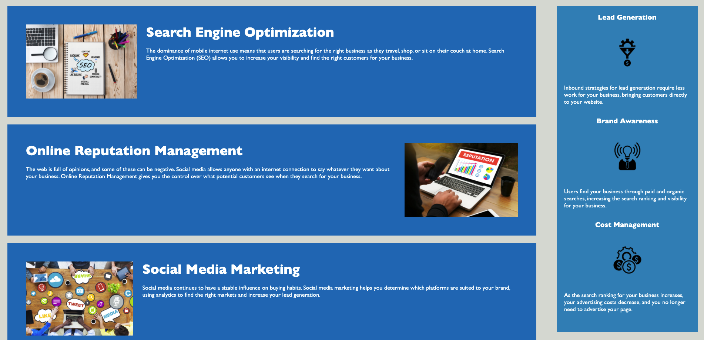
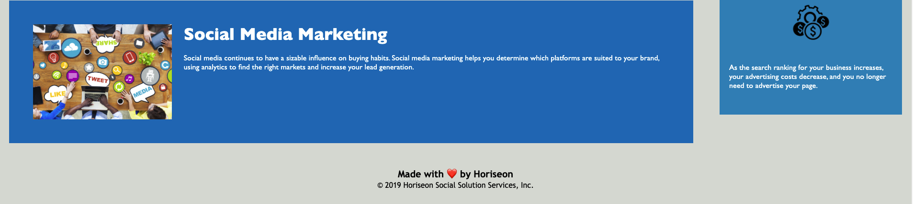

# Horiseon Marketing 

## Description 

Refactored Horiseon Marketing's website by editing their website's codebase in a way that follows accessibility standards to optimize the site for search engines. 

## How did I accomplish this you ask? 

First I adjusted the HTML by adding semantic elements in place of the generic ones in the original codebase. for example I:
  - Added a `<header>` element 
  - Wrapped navigation links in a `<main>` element 
just to name a few. 

I reworked the structure of the HTML to assure all elements followed a logical structure. then alt attributes were added to the images on the page to further aid in accessibility.

Changed a few heading attributes to assure they fall in sequential order on the page and wrapped the company's name in the title element.

In regards to the external style sheet, I consolidated and organized the CSS selectors and properties. I also adjusted the structure of the style sheet to mirror that of the HTML. For more detail please see the external style sheet as comments were added for clarity.

## Screenshots of the finished project

## Tech used

- HTML
- CSS

## Link to deployed application

https://doublelforce5.github.io/HoriseonMarketing/

## MIT license

Copyright (c) 2021 Olivia Lopez 

Permission is hereby granted, free of charge, to any person obtaining a copy
of this software and associated documentation files (the "Software"), to deal
in the Software without restriction, including without limitation the rights
to use, copy, modify, merge, publish, distribute, sublicense, and/or sell
copies of the Software, and to permit persons to whom the Software is
furnished to do so, subject to the following conditions:

The above copyright notice and this permission notice shall be included in all
copies or substantial portions of the Software.

THE SOFTWARE IS PROVIDED "AS IS", WITHOUT WARRANTY OF ANY KIND, EXPRESS OR
IMPLIED, INCLUDING BUT NOT LIMITED TO THE WARRANTIES OF MERCHANTABILITY,
FITNESS FOR A PARTICULAR PURPOSE AND NONINFRINGEMENT. IN NO EVENT SHALL THE
AUTHORS OR COPYRIGHT HOLDERS BE LIABLE FOR ANY CLAIM, DAMAGES OR OTHER
LIABILITY, WHETHER IN AN ACTION OF CONTRACT, TORT OR OTHERWISE, ARISING FROM,
OUT OF OR IN CONNECTION WITH THE SOFTWARE OR THE USE OR OTHER DEALINGS IN THE
SOFTWARE.
